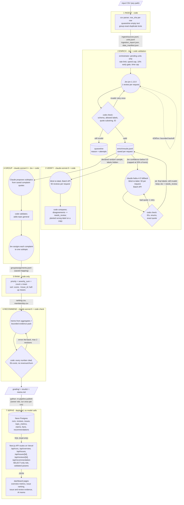
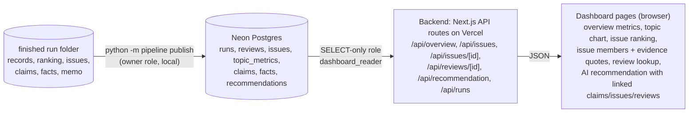

# Spotify review insight pipeline (Final Assignment)

Advising Spotify at the end of the May 2022 – Nov 2023 review window: **where should next quarter's product effort go — access, usability, playback, or billing/support?** This repository is a saved program that turns the 660,622-review CSV into that recommendation, with traceable evidence.

> **Status (2026-10-07): final run complete.** The final run classified a seeded random sample of **100,000 of the 660,622 reviews** (the brief allows a scope of at least 100,000), accounted for every row, and cost **$10.89** (list price, including three memo regenerations). See [Final run](#final-run-100000-review-seeded-sample). [Development results](#development-results) come from real model calls on the 500-review and 10,000-review checkpoints, the hand-labelled golden 50, 30 held-out reviews and 13 synthetic injection cases. Offline tests use fake providers and are **not** run evidence.

- **Live dashboard: https://spotify-insight-dashboard.vercel.app** (public, read-only, no login). It shows the final run by default; the 500 and 10,000 development runs are selectable.
- **Delivery note:** [`DELIVERY_NOTE.md`](DELIVERY_NOTE.md)
- Grading export: [`grading/`](grading/) (final run; passes the course checker, see [Final run](#final-run-100000-review-seeded-sample))
- Human-readable results: [`results/`](results/) (final run)
- Decision memo: [`results/memo.md`](results/memo.md) (final run)
- Interruption/resume evidence: [`evals/recovery/`](evals/recovery/), including the screen recording [`interruption_resume_terminal.mp4`](evals/recovery/interruption_resume_terminal.mp4)
- Design choices and label examples: [`DESIGN.md`](DESIGN.md)
- Golden-set labelling instructions: [`evals/golden/LABELING.md`](evals/golden/LABELING.md)
- **100-review cost/runtime calculator:** [`cost/`](cost/), with a [measured report](cost/report.md) and [offline replay instructions](cost/README.md)

## Rubric → evidence map

| Rubric item | Evidence |
|---|---|
| **Deliverable 1** Accessible code, setup and artifacts | [Setup](#setup), [Run](#run), `requirements.txt`, `.env.example` (key names only), [`results/`](results/) |
| **Deliverable 2** Architecture, shared schema, provenance | [Architecture](#architecture), `pipeline/rubric.py` (Jev questions), `pipeline/verify.py` / `group.py` / `memo.py` (role prompts and schemas), `label_config` on every record and call, `run_manifest.json` (code version, argv, settings) |
| **Deliverable 3** Memo numbers linked to calculations and evidence | `claims.csv` ↔ `ranking.csv` (course checker recomputes both), `memo_check.json` (every number cited, and every issue ID, review ID and quote validated). Development: [`evals/dev500/memo_v2.md`](evals/dev500/memo_v2.md), [`claims.csv`](evals/dev500/claims.csv), [`memo_check_v2.json`](evals/dev500/memo_check_v2.json). Final: [`results/memo.md`](results/memo.md), [`grading/claims.csv`](grading/claims.csv), [`results/memo_check.json`](results/memo_check.json) (final memo passed on its second draft, 0 errors) |
| **Deliverable 4** Recommendation, alternatives, limitations | Development memo [`evals/dev500/memo_v2.md`](evals/dev500/memo_v2.md); final [`results/memo.md`](results/memo.md); [Limits](#limits) |
| **Testing 1** 50 human labels, per-field comparison, error analysis | [Held-out 30](#held-out-check-of-the-fallback-choice-evalsheldout) (fresh cases after golden-influenced changes); [`evals/golden/golden_50_human_labels.csv`](evals/golden/golden_50_human_labels.csv), final setup [`final_setup/summary.json`](evals/golden/final_setup/summary.json) (all three 78%), [`summary.json`](evals/golden/summary.json), [`cases.json`](evals/golden/cases.json), [`disagreements.md`](evals/golden/disagreements.md), [`head_to_head.json`](evals/golden/head_to_head.json); [Golden set](#golden-set-50-hand-labelled-reviews) |
| **Testing 2** Independent verification, planted-error and injection tests | Final: [`results/verification_report.json`](results/verification_report.json) (1,000 random), [`results/planted_label_test.json`](results/planted_label_test.json) (25/25 detected). Development: [`evals/dev500/verification_report.json`](evals/dev500/verification_report.json), [`verification_comparisons.json`](evals/dev500/verification_comparisons.json), [`planted_label_test.json`](evals/dev500/planted_label_test.json), [`evals/injection_results.json`](evals/injection_results.json), [`evals/offline/planted_export_errors.json`](evals/offline/planted_export_errors.json) |
| **Testing 3** Real 100-review cold/warm pilot, offline calculator, retry/spending/recovery controls | [`cost/report.md`](cost/report.md): measured cold, warm and 2-worker pilot. [`cost/README.md`](cost/README.md): offline `python -m pipeline cost` replay. Evidence: [`cost/pilot_calls.jsonl`](cost/pilot_calls.jsonl), [`usage.csv`](cost/usage.csv), [`rates.csv`](cost/rates.csv), [`pilot_records.jsonl`](cost/pilot_records.jsonl). Controls: `pipeline/retry.py`, `pipeline/budget.py`, [`evals/offline/test_report.txt`](evals/offline/test_report.txt); [`cost/refresh.md`](cost/refresh.md) (500/10,000 refresh and 100k projection); actual: [`results/run_summary.json`](results/run_summary.json) |
| **Working 1** Full ingestion, coverage, classification | [`results/ingestion_report.json`](results/ingestion_report.json), [`grading/ingestion.json`](grading/ingestion.json), checker self-check [`evals/final100k/self-check.json`](evals/final100k/self-check.json): all 660,622 IDs accounted for, 100,000 completed in scope |
| **Working 2** Staged program, bounded calls, handoffs, resume | `python -m pipeline run`, `grading/calls.jsonl.gz`, `checkpoint_before.json` / `checkpoint_after.json`, [`evals/recovery/`](evals/recovery/) (planned stop + recorded Ctrl-C interrupt, both resumed) |
| **Working 3** Reproducible ranking; deployed dashboard backed by a database, with grounded AI recommendations | `python -m pipeline rerank --grading-dir grading` (no model calls); live dashboard https://spotify-insight-dashboard.vercel.app ([Dashboard, backend and database](#dashboard-backend-and-database)); final memo [`results/memo.md`](results/memo.md) |

## Architecture



In the diagram, circles are model judgments and rectangles and diamonds are code. Stage 7 is the deployed part: `publish` loads a finished run's saved outputs into Postgres, the backend serves them read-only, and the dashboard displays them; viewing it never calls a model. Code owns dispatch, state, validation, budgets, retries, record accounting and every piece of arithmetic. The models only read language:

- **Jev** answers fixed-choice questions.
- **Claude** handles blind verification, naming subtopics, and writing the memo.

Every handoff is saved, and each stage has its own stop condition:

| Stage | Input | Output | On failure | Stops when |
|---|---|---|---|---|
| ingest | CSV | sources, units, profiles | duplicate ID → abort (contract needs one record per ID) | file read |
| enrich | pending units | results, failures, checkpoints | invalid → 1 retry → quarantine; transient → backoff ≤5 attempts | all units done, spend cap, early gate, time cap, Ctrl-C, `--stop-after-units` |
| verify | declared random sample (text only) | verdicts, report, planted test | invalid → 1 retry with the error; transient → backoff | sample done or cap |
| group | complaint quotes → taxonomy; complaint texts → Jev | issues.json, assignments.jsonl | failed assignment → `<topic>.general` with the reason recorded | all complaints assigned |
| rank | records + membership | ranking.csv, membership.csv | invalid severity or duplicate pair → abort | — |
| recommend | aggregates + evidence pack | memo.md, claims, check | check errors fed back, up to 2 revisions, then saved with the failing check | check passes or 3 rounds |

## How this is a multi-agent pipeline

The brief defines it this way: distinct roles with inspectable handoffs, coordinated by code. Unrestricted autonomy and multiple providers are not required. Each agent below has its own instructions, inputs, output schema, saved evidence and stop rule. Every model call is logged with its role in `calls.jsonl`. The **code orchestrator** (`pipeline/cli.py`, `pipeline/dispatch.py`) runs a fixed sequence. It chooses the next step, enforces budgets and retries, validates every handoff, and owns all record accounting and arithmetic.

| Agent (role in `calls.jsonl`) | Model | Instructions | Reads | Writes (saved handoff) | Stops / on failure |
|---|---|---|---|---|---|
| Enricher (`enrich`) | `jev-1.13.0` | question set in `pipeline/rubric.py` | one review's text | `enrich/results.jsonl` | all texts done, or a cap; invalid output → 1 retry → quarantine |
| Fallback enricher (`enrich`) | `claude-sonnet-5` | `pipeline/fallback.py` | low-confidence texts only, blind, ≤50 per request, ≤20% of texts | `enrich/fallback.jsonl` | cap reached; bad quote → 1 retry → keep Jev's labels, flagged `needs_review` |
| Verifier (`verify`) | `claude-sonnet-5` | `pipeline/verify.py` | declared random sample, blind to the enricher | `verify/comparisons.json`, `verify/report.json` | sample done; invalid → 1 retry with the error |
| Issue designer (`group`) | `claude-sonnet-5` | `pipeline/group.py` | a bounded sample of complaint quotes | `group/issues.json` | one request, schema-checked |
| Issue assigner (`group`) | `jev-1.13.0` | one Choice question per topic | one complaint's text | `group/assignments.jsonl` | all complaints assigned; failure → catch-all issue, recorded |
| Memo writer (`memo`) | `claude-sonnet-5` | `pipeline/memo.py` | saved aggregates plus a bounded evidence pack only | `memo/memo.md`, `memo/check.json` | code check passes, up to 2 revisions |

The same program and the same agents run at every scale: the 100-review pilot, the 500 and 10,000 checkpoints, and the final run. "Workers" (`--workers`) is concurrency *within* an agent, several requests in flight at once sharing one rate limiter and one spend ledger. It is not additional agents.

## Dashboard, backend and database

**Live:** https://spotify-insight-dashboard.vercel.app. It's public and read-only, with no account needed, and viewing it never calls a model.



- **Database** (`db/schema.sql`): `python -m pipeline publish` loads a finished run's saved outputs: every review record with its source text and labels, plus issues, the ranking, per-topic metrics, claims, facts and the AI-generated memo. `python -m pipeline db-setup` creates the tables and a **SELECT-only** role for the dashboard; its password is generated straight into `.env` and never printed.
- **Backend** (`dashboard/app/api/*`): route handlers query Postgres at request time. Every parameter is validated against a strict pattern, and queries are parameterised. The read-only connection string exists only as a server-side Vercel secret.
- **Dashboard** (`dashboard/app/*`): pages fetch only from the backend API.
- **AI recommendation:** the memo written by `claude-sonnet-5` from the saved aggregates. Every claim ID links to its issue and number, every issue ID to its member reviews, and every review ID to the original text with the evidence quote highlighted.
- **Why the numbers match:** the dashboard shows exactly what is in `ranking.csv`, `claims.csv` and the records that the course checker recomputes.
- **Run it locally:**
  ```bash
  cd dashboard && npm install && echo "DASHBOARD_DATABASE_URL=..." > .env.local && npm run dev
  ```

## Models, settings and roles

| Role (`calls.jsonl`) | Model ID | Settings | Prompt version |
|---|---|---|---|
| enrich | `jev-1.13.0` (pinned, not the alias) | 1 review per request; Choice for topic, intent and severity; Score for sentiment; Noul for "unclear"; Choice over code-cut sentences for the quote | `label_config` = `jev-1.13.0+prompt-<hash>+schema-v1` |
| enrich (fallback) | final run: `claude-haiku-4-5` (no extended thinking, `--fallback-max-tokens 8000`); 10k run: `claude-sonnet-5` (effort medium) | re-labels **blind** every text whose minimum Jev confidence is below 0.5, capped at 20% of texts; up to 50 reviews per request; JSON schema with an exact-substring quote; Message Batches API at 50% price (final run) or standard API (10k) | `label_config` gains `+fallback-<model>-effort-<effort>-t0.5-cap0.2-<hash>` for every record in the run |
| verify | `claude-sonnet-5` | adaptive thinking, effort medium, JSON-schema output, 50 per request, `max_tokens` 16000; Message Batches API in the final run | `claude-sonnet-5+verify-<hash>+schema-v1` |
| group | `claude-sonnet-5` then `jev-1.13.0` | taxonomy via JSON schema; Jev Choice per complaint | `...+group-taxonomy-<hash>`, `...+group-assign-<hash>` |
| memo | final run: `claude-opus-5-5` (effort high, `--memo-model`); development runs: `claude-sonnet-5` | plain markdown, code check, up to 3 rounds | `<model>+effort-<effort>+memo-<hash>+schema-v1` |

Each hash is taken over the exact prompt, schema and post-processing rules, so changing any of them creates new work rather than reusing cached results. Only `review_text` is sent to any model. The golden-50 human labels are read only by `score-golden`. Golden review IDs are also kept out of the verification sample, the taxonomy examples and the memo evidence pack (`--exclude-golden`).

## Setup

Python 3.11 is required.

```bash
git clone https://github.com/anthonybrites-cmyk/spotify-insight-pipeline.git && cd spotify-insight-pipeline
python3 -m venv .venv && .venv/bin/pip install --no-cache-dir -r requirements.txt   # pinned: anthropic, certifi, psycopg; the rest is stdlib
cp .env.example .env    # then paste TYPESAFE_API_KEY and ANTHROPIC_API_KEY (only needed for paid runs)
.venv/bin/python -m pipeline keys   # prints True/False per key, never the value
```

Data: download the course dataset ZIP from [Google Drive](https://drive.google.com/file/d/1P0rUoAS_wVjp3BYKqXMEyD4u0uJP1Bvf/view) (use Drive's Download button; the preview can omit the large CSV), unzip it anywhere, and point `DATA` at that folder. The raw CSV is not committed. `spotify_reviews_18months.csv` SHA-256 `1fc85de68a304dd8978b537cfa58793d5f41cbaf417fa32cb53899f83a2fcef6` (97,400,616 bytes). Original source: BwandoWando, [3.4 Million Spotify Google Store Reviews](https://www.kaggle.com/datasets/bwandowando/3-4-million-spotify-google-store-reviews), version 2, Kaggle (CC0: Public Domain).

## Run

**No API key is needed to inspect or re-rank.** These commands make no model calls:

```bash
.venv/bin/python -m pipeline rerank --grading-dir grading     # recompute ranking from records + membership; diff vs saved
.venv/bin/python -m pipeline check --input "$DATA/spotify_reviews_18months.csv" --grading-dir grading --out-dir runs/check
.venv/bin/python -m unittest discover -s tests -v             # offline tests (fake providers)
```

**Paid runs** (`DATA="$HOME/code/NEW - Final Assignment - Spotify Reviews Dataset"`; `G="--exclude-golden $DATA/golden_50_to_label.csv"`):

```bash
# 1) 500-review development run (done; development cap raised from $2 to $5 on 2026-09-30)
.venv/bin/python -m pipeline run --input "$DATA/checkpoint_500.csv" --run-dir runs/dev500 $G \
  --budget-group dev --budget-usd 5 --verify-n 100 --grading-dir runs/dev500/grading --results-dir runs/dev500/results
# 2) 10,000-review development checkpoint with the Claude fallback (standard API); also verifies all 268
#    non-English texts as a separate stratum
.venv/bin/python -m pipeline run --input "$DATA/analysis_10000.csv" --run-dir runs/dev10k $G \
  --budget-group dev --budget-usd 10 --fallback standard --claude-effort medium --workers 2 --verify-n 300 \
  --verify-extra-groups non_english_latin,non_latin_script \
  --grading-dir runs/dev10k/grading --results-dir runs/dev10k/results
# 2b) Only if non-English agreement is clearly worse: translation test on those 268 texts
#     (enrichment only; reuses the 10k run's blind verifier labels; no second verification)
.venv/bin/python -m pipeline subset --input "$DATA/analysis_10000.csv" --out runs/lang10k/non_english.csv
.venv/bin/python -m pipeline run --input runs/lang10k/non_english.csv --run-dir runs/lang10k --translate \
  --stages ingest,enrich --budget-group dev --budget-usd 5 --fallback standard
.venv/bin/python -m pipeline compare-translation --baseline-run runs/dev10k --translated-run runs/lang10k
# 3) Golden set: enrichment only, on a copy with the labels stripped; then score against your labels
.venv/bin/python -m pipeline golden-input --golden "$DATA/golden_50_to_label.csv" --out runs/golden/golden_50_texts.csv
.venv/bin/python -m pipeline run --input runs/golden/golden_50_texts.csv --run-dir runs/golden --stages ingest,enrich \
  --budget-group dev --budget-usd 5
.venv/bin/python -m pipeline score-golden --run-dir runs/golden --golden evals/golden/golden_50_human_labels.csv
.venv/bin/python -m pipeline score-golden --run-dir runs/golden --golden evals/golden/golden_50_human_labels.csv \
  --adjudication evals/golden/adjudication.json --out-dir evals/golden/adjudicated   # post-hoc labels, reported separately
# 4) Final run: a seeded 100,000-review sample of the full corpus (every row is still ingested; the rest are
#    quarantined "out of scope"). Haiku 4.5 fallback and Sonnet 5 verification both via the Message Batches API,
#    5 workers (Jev at <= 30 requests/s), hard cap $15. First invocation: interruption demo (recorded), then resume.
F="--input $DATA/spotify_reviews_18months.csv --run-dir runs/final100k $G --scope-sample 100000 \
  --budget-group full --budget-usd 15 --fallback batch --fallback-model claude-haiku-4-5 --fallback-effort none --fallback-max-tokens 8000 \
  --verify-n 1000 --verify-mode batch --workers 5"
.venv/bin/python -m pipeline run $F --stop-after-units 5000
.venv/bin/python -m pipeline run $F --grading-dir grading --results-dir results
# 5) Live prompt-injection cases (synthetic, excluded from business results)
.venv/bin/python -m pipeline eval-injection
```

**Resume:** rerun the same command. Completed units under the same `label_config` are never sent again. Calls made after the first invocation are logged as `phase: "resume"`.

**Stopping for the day:** `--max-minutes N` stops dispatching after N minutes and saves; a Batch API job keeps processing on Anthropic's side and the saved batch ID is polled on the next run, from any network.

**Interrupt:** press Ctrl-C once for a graceful stop. The program finishes in-flight requests, saves them, and writes a `completed_ids` snapshot. A second Ctrl-C aborts immediately.

## Spending, retries and failure accounting (all in code)

- **Hard cap per budget group.** The ledger in `budgets/<group>.jsonl` persists across runs. Before each call, a worst-case cost is reserved; for Claude that includes the full `max_tokens` of output. The call is not sent if it could exceed the cap.
- **Early 10% gate.** At 10% of enrichment units, the run's spend must be at most 10% of the cap. Otherwise the run halts and prints a projection. It continues only with `--accept-early-gate`.
- **Time cap.** `--max-minutes` stops dispatching and saves progress.
- **Retries.** Invalid output is retried **at most once**; for Claude, the validation error is fed back. After that, the unit is quarantined with the reason and attempt count. Rate limits and transient errors get bounded exponential backoff that honours `retry-after`: up to 5 attempts for Jev, 4 for Claude. Every failed attempt is logged as `outcome: "failed"`.
- **Exact-duplicate reuse.** 660,609 nonempty rows collapse to 484,189 distinct texts. The other IDs get `cache_source_id` pointing to the directly classified original. Every ID keeps its own record and is counted separately.
- **Statuses.** Each record is `completed`, or `quarantined` with a `reason` and `attempts`. Reasons are `empty_review_text`, `out_of_scope: …` (not in a declared sample scope), `enrich_failed: …`, or, for an unfinished run, `pending_fallback` / `pending_not_processed`.
- **Usage and cost.** These are provider-reported tokens times published list prices (Jev $0.042 per million input tokens, output free; Sonnet 5 $2/$10 per million), reported in `run_summary.json`. Failed attempts that returned no usage are logged with 0 tokens and `usage_available: false`; they are not estimated.

## 100-review cost and runtime pilot

Full report: [`cost/report.md`](cost/report.md). Measured on `cost_100.csv` (sha256 `c884ac3b…`, unchanged). Every stage ran: Jev enrichment with the capped Claude fallback, a declared 20-review verification sample, grouping, ranking and the memo.

| Run | Workers | Wall-clock | New calls | API cost |
|---|---|---|---|---|
| cold | 1 | 110.6 s | 143 (101 enrichment) | $0.1776 |
| warm (saved results) | 1 | 0.06 s | **0** | $0 |
| cold | 2 | 70.4 s | 139 (101 enrichment) | $0.1063 |

- **Records:** all 100 completed and 0 failed, with 0 retries. 7 of the 100 texts went to the Claude fallback, under the 20% cap.
- **Cold-run memo cost:** the one-worker cold run spent $0.10 on the memo across 3 rounds. Rounds 2–3 were caused by a quote-check bug the pilot exposed, now fixed; all three drafts pass the corrected check.
- **Measured cost per review:** Jev $0.0000642 per distinct text, the Claude fallback $0.0026, and verification $0.0016.
- **Full-run projection** at the measured rates, with the planned Batch-API fallback: **~$82 base** (under the $90 cap) and ~$207 conservative (fallback at the full 20% cap and variable costs ×1.25). The projection is refreshed after the 500 and 10,000 runs.

### Checkpoint refresh after the 500 and 10,000 runs ([`cost/refresh.md`](cost/refresh.md))

`python -m pipeline cost refresh` (offline) re-prices the saved call logs of both development runs (committed as `evals/dev500/` and `evals/dev10k/calls.jsonl.gz`) with `cost/rates.csv`, adds the Haiku fallback cost measured in the evals ($0.000541 per review over 104 reviews), and projects the final 100,000-review scope (78,146 distinct texts):

| Scenario | Projected cost |
|---|---|
| **Planned:** Haiku Batch fallback (16.3% of texts, measured), Sonnet Batch verification of 1,000 | **~$10.06** |
| Conservative: fallback at the 20% cap, variable costs ×1.25 | ~$13.55 |
| Reference: Sonnet Batch fallback | ~$19.98 |
| Reference: Haiku fallback, verification on the standard API | ~$10.80 |

Time (modelled from the measured 147 ms median Jev call): 5 workers, capped at 30 requests/s, gives ≈ 0.7 h of Jev enrichment and ≈ 0.3 h of grouping (2 workers measured 12.2 texts/s in the 10k run), plus Batch API turnaround for the fallback and verification (usually under an hour). The interruption-demo slice of the final run measures the 5-worker rate.

## Decisions log

| Date | Decision | Evidence / reason |
|---|---|---|
| 2026-09-29 | Jev for every review's fixed labels; Claude for verification, taxonomy and memo | Brief guidance; Claude for every review was measured at ~$270–540 |
| 2026-09-30 | Severity 5 adds health/physical harm, **clarified to an actual injury such as hearing loss** | Your call while labelling; prompted by golden row `46c0b49f…` (disclosed, see DESIGN.md) |
| 2026-09-30 | Golden labels scored strictly; ambiguity goes in separate columns | The brief asks for an ambiguous-case count; the instructor's multiple accepted labels apply only to their benchmark |
| 2026-09-30 | Keep the **full** Jev wording | Compact wording saved 28% of tokens but cost 3 points of topic agreement on the same verifier labels |
| 2026-09-30 | **Claude fallback for every text with Jev confidence below 0.5**: standard API for the 10k run, Batch API for the full run; full-run cap **$90**; development cap **$5** | Golden head-to-head in the low band: Jev 1/7 vs Claude 5/7 all-correct (disclosed); to be checked on ~30 fresh held-out 10k reviews |
| 2026-09-30 | Premium-locked controls → `billing` (verifier and fallback prompts state it explicitly); your adjudication of golden disagreements recorded separately | Your answers (a)–(d); [`evals/golden/adjudication.json`](evals/golden/adjudication.json) |
| 2026-09-30 | Severity for paywalled controls stays on the **contract's reading**: a control explicitly locked behind Premium is a restricted function (3); ad overload alone is annoyance (2) | The contract defines 3 as "a degraded or restricted function", and the instructor's benchmark follows the contract. Your golden labels of 2 on those rows stand as your judgment and are explained in the error analysis |
| 2026-09-30 | Declared fallback cap **20%** of distinct texts, lowest confidence first; **1 worker by default**; Claude reasoning effort and output cap are part of every Claude config tag | Updated brief and `COST_CALCULATOR.md` |
| 2026-09-30 | Real cold and warm pilot at 1 worker, plus a cold pilot at 2 workers | Your call; the 2-worker run measured a 1.39× enrich-stage speedup |
| 2026-10-01 | Development cap raised to **$10**; Claude reasoning effort stays **medium** for the fallback and verifier | Effort test: low saved about 17% per review but changed 27% of fallback decisions and matched the human on 4 of 7 golden low-confidence reviews, versus 5 of 7 for medium ([`evals/effort_test/report.json`](evals/effort_test/report.json)) |
| 2026-10-06 | **Final run scope: a seeded random sample of 100,000 review IDs** (the updated brief accepts ≥100,000), **sampled IDs only**: exact-duplicate copies outside the sample are quarantined as out of scope, not completed by reuse | Projected ~$11–16 against ~$65–93 for the full corpus. Sample-only keeps the business aggregates a fair random sample; including copies would complete about 238,000 rows but over-weight repeated short texts. All 660,622 rows are still ingested, profiled and accounted for. |
| 2026-10-06 | **Fallback model: Claude Haiku 4.5 without extended thinking, via the Batch API, for every qualifying text (≤20% cap)**; verification (1,000), taxonomy and memo stay on Sonnet 5; final-run hard cap **$15** | Sonnet fallback measured at $0.00204 per review vs Haiku $0.00052. Projected 100k run: ~$10.65 with Haiku vs ~$20 with Sonnet (both Batch). Haiku got all three labels right on 3 of 7 golden low-confidence reviews, vs 5 of 7 for Sonnet and 1 of 7 for Jev ([`evals/effort_test/`](evals/effort_test/)) |
| 2026-10-06 | **Class 7 review (parallel, caching, batching):** verification moves to the Batch API (`--verify-mode batch`, saves ~$0.74); 5 workers instead of 2 (same cost, ≈2.5× faster, within the 30 requests/s cap under TypeSafe's 40); no prompt caching (Haiku 4.5 caches only prompts of 4,096+ tokens and ours are ~1,200; Sonnet verification would save cents; Jev has no prompt cache and already asks all questions in one request); no reuse of 10k results (only 2,054 of 78,146 texts overlap, ~$0.13) | Class 7 slides 50–70; [`cost/refresh.md`](cost/refresh.md) |
| 2026-10-07 | **Final memo written by `claude-opus-5-5` (effort high)**, memo stage only | Human review of the regenerated Sonnet 5 drafts found unsupported or incoherent arguments that the number checks cannot catch; the user approved a stronger model for this single bounded task ($0.16 for two rounds) |
| 2026-10-06 | No translation | 10k language strata, all-three agreement with the verifier: English 77.0%, Latin-script non-English 71.6%, non-Latin script 88.4%. A modest gap, and translation would add cost |

## Development results

Everything below comes from real API calls, as recorded in each run's `calls.jsonl`.
- **Cost:** provider-reported tokens multiplied by list price. These are not invoices.
- **Spend:** total development spend so far is **$0.53** of the $2 development cap.

### 500-review checkpoint (`checkpoint_500.csv`)

| Measure | Value |
|---|---|
| Source rows / completed / quarantined | 500 / **500** / 0 |
| Distinct texts sent to Jev / exact-duplicate reuses (`cache_source_id`) | 479 / 21 |
| Failed calls / retries | 0 / 0 |
| `needs_review` true | 78 (15.6%) |
| Issues ranked / complaint memberships | 37 / 248 |
| Course checker coverage | 500/500 valid; its only flags are the missing interruption/resume evidence, which comes from the full run ([`self-check.json`](evals/dev500/self-check.json)) |
| `rerank` from the saved export | identical ranking (sha256 `09b2b327…`) |
| Wall-clock time by stage | enrich 16 s, verify 68 s, group 25 s, memo 106 s (three memo invocations) |

**Usage and cost by role:**

| Role | Model | Successful calls | Input tokens | Output tokens | Cost |
|---|---|---|---|---|---|
| enrich | `jev-1.13.0` | 479 | 720,534 | 107,143 | $0.0303 |
| verify | `claude-sonnet-5` | 2 | 11,036 | 9,060 | $0.1127 |
| group (taxonomy) | `claude-sonnet-5` | 1 | 8,446 | 2,016 | $0.0371 |
| group (assignment) | `jev-1.13.0` | 177 | 108,049 | 16,341 | $0.0045 |
| memo | `claude-sonnet-5` | 7 | 51,872 | 13,482 | $0.2386 |
| **Total** | | | | | **$0.4231** |

The memo was run three times. The first version used an outdated prompt structure, which was then fixed ([`memo_v1_old_prompt.md`](evals/dev500/memo_v1_old_prompt.md)). The second time, a false alarm in the money check forced a revision; the check now allows sentences that only say money data is absent. The development memo ([`memo_v2.md`](evals/dev500/memo_v2.md)) recommends **usability**: `usability.ad_frequency` (rank 2) and `usability.playback_control_restrictions`, closely tied to `billing.features_locked_behind_premium` (rank 3). Rank 1, `other.general`, holds non-specific complaints. *Development sample only; the final recommendation comes from the full run.*

### Independent verification: Claude labels blind, code compares

The declared random sample is 100 distinct texts; golden-50 IDs are excluded. The verifier never sees Jev's labels.

| Jev confidence band | n | Topic | Intent | Severity exact | All three | Material disagreements |
|---|---|---|---|---|---|---|
| All (headline) | 100 | 90% | 98% | 87% | 77% | 13 |
| High (≥0.8) | 61 | 95% | 98% | 98% | 92% | 4 |
| Mid (0.5–0.8) | 27 | 85% | 96% | 74% | 59% | 6 |
| Low (<0.5) | 12 | 75% | 100% | 58% | 42% | 3 |

- **Planted wrong label.** In a separate copy of the comparisons, Jev's topic was deliberately changed on 25 agreeing cases. The comparison code caught **25 of 25**.
- **Who is right varies.** On premium-only controls, the contract says `billing`. Jev followed that, while Claude chose `usability` (e.g. `66c56c76…`). *[Labeller: billing; the verifier was wrong. The verifier and fallback prompts now state this rule explicitly.]*

### Golden set (50 hand-labelled reviews)

The labels were written and committed before any model run (commit `821258d`). Enrichment ran on a copy with the label columns stripped (`golden-input`). The scoring is strict: each prediction must match the single primary human label.

| | Topic | Intent | Severity exact | All three | Severity MAE |
|---|---|---|---|---|---|
| **Final setup: Jev + Haiku fallback, final prompt** ([`final_setup/`](evals/golden/final_setup/), $0.008, 2026-10-07) | 88% | 96% | 86% | **78%** | 0.18 |
| Final setup, lenient (also accepts the alternatives you noted) | 92% | 96% | 88% | — | — |
| Final setup, adjudicated labels ([`final_setup/adjudicated/`](evals/golden/final_setup/adjudicated/)) | 86% | 96% | 86% | 76% | 0.18 |
| Jev alone, pre-amendment prompt (2026-09-30) | 88% | 96% | 84% | 74% | 0.24 |
| Jev alone, lenient | 90% | 98% | 88% | — | — |
| Jev alone, adjudicated: your post-hoc decision (c) applied, `dceb14e7…` topic → playback ([`adjudication.json`](evals/golden/adjudication.json)) | 90% | 96% | 84% | 76% | 0.24 |

The final-setup rows rerun the label-stripped golden texts with exactly the final run's `label_config` (the severity-5 wording clarified on 2026-10-01, and the Haiku 4.5 fallback). Jev decided 43 texts and got all three labels right on 36; Haiku re-labelled the 7 low-confidence texts and got 3 right (Jev alone got 1 of those 7). The golden set informed the fallback choice, so these final-setup numbers are not an independent test; the [held-out 30](#held-out-check-of-the-fallback-choice-evalsheldout) are.

Other measures:
- **Sentiment:** MAE 0.118; 48 of 50 within the predeclared ±0.5 tolerance (final setup: MAE 0.108, 48 of 50).
- **Ambiguous cases:** 4.
- **Missing or quarantined predictions:** 0.
- **`needs_review` treated as a prediction:** precision 0.33, recall 0.33 (2 true positives, 4 false positives, 4 false negatives); final setup precision 0.29, recall 0.33. It does not track human judgment well.

**Error analysis.** 13 rows have a label disagreement and 1 differs only on sentiment; all are listed in [`disagreements.md`](evals/golden/disagreements.md). Your adjudication of each pattern is in brackets. The main patterns:
1. **Severity 2 vs 3 for premium restrictions and ad load.** Jev rates "basic features are premium" and "unusable with constant ads" as 3 (a restricted function). The human label is 2 (annoyance). *[Labeller: 2, annoyance. The classifier deliberately keeps the contract's reading, though: a control explicitly locked behind Premium is a restricted function (3), and ad overload alone is 2. So on `991b6b3a…` ("limited functionality") and `16d640e9…` ("basic features is premium"), the disagreement is a documented definitional choice. On `d2f3874f…` ("unusable with constant ads"), Jev's 3 is an error even under the contract's reading.]*
2. **Usability vs playback** when an update removes controls ("can't play the songs I like / can't rewind"). Jev chose playback; the human chose usability. *[Labeller, post hoc: **playback**. Jev was right and the original golden label was the error; see the adjudicated row above.]*
3. **Health harm.** For "my ears feel like they explode", Jev chose 5 under the amended severity-5 definition; the human label is 2. *[Labeller: 2. This is not serious harm; level 5 needs an actual injury such as hearing loss. The rubric now says so.]*
4. **Low confidence predicts errors.** Jev got all three labels right on only 1 of the 7 golden reviews where its confidence was below 0.5.

**Jev vs Claude on the same 50** ([`head_to_head.json`](evals/golden/head_to_head.json), one Claude call, $0.064). This comparison is disclosed because it informs the choice of final setup.

| Jev confidence band | n | Jev all three | Claude all three |
|---|---|---|---|
| High (≥0.8) | 32 | **90.6%** | 84.4% |
| Mid | 11 | **63.6%** | 54.5% |
| Low (<0.5) | 7 | 14.3% | **71.4%** |
| All | 50 | 74% | 76% |

### Held-out check of the fallback choice ([`evals/heldout/`](evals/heldout/))

The golden set influenced two choices: adding a Claude fallback, and choosing Haiku for it. So both were re-checked on **30 fresh reviews** the golden set never touched. They were drawn with a seeded random sample from the 1,362 texts in the 10k run where Jev's confidence was below 0.5, with golden IDs excluded. The user hand-labelled them blind (no model output shown). Three emoji-only reviews were changed from `complaint` to `unclear` after a reminder of the written rubric rule, still blind. Scoring is strict: the primary human label only.

| Labeller on these 30 hard reviews | Topic | Intent | Severity | All three |
|---|---|---|---|---|
| Jev alone | 25 | 17 | 17 | **12** |
| Sonnet 5 fallback (saved from the 10k run) | 27 | 23 | 20 | **17** |
| **Haiku 4.5 fallback** (no thinking; the final-run setting) | 21 | 26 | 23 | **16** |

Haiku cost $0.016 for the 30 reviews on the standard API (the final run uses Batch at half price). All 30 of its quotes were exact. The result supports the decision: in the low-confidence band, the fallback beats Jev alone, and Haiku is close to Sonnet at about a quarter of the cost. It is weaker on topic and stronger on intent and severity. Thirty cases are a diagnostic, not a population estimate. This is the last hand-labelled set: all later quality checks are automated (the blind Sonnet verifier on 1,000 random reviews, planted errors, injection cases).

### Injection and control cases ([`evals/injection_results.json`](evals/injection_results.json))

There are 13 synthetic reviews: 7 prompt-injection attempts and 6 controls, including a held-out physical-harm case. **All 13 passed through Jev, and all 13 passed through the Claude verifier** (one 13-review batch, with returned IDs checked). Cost: $0.018. These cases are excluded from all business results.

### Design experiments

- **Compact Jev wording** ([`rubric_compact_vs_full.json`](evals/dev500/rubric_compact_vs_full.json)): 1,085 vs 1,504 tokens per review (−28%). Agreement with the same blind verifier labels was topic 87% vs 90%, intent 98% vs 98%, and severity 88% vs 87%. **Decision: keep the full wording.** The saving (~$8.50 on the full run) did not justify the small loss in topic agreement.
- **Language:** the 500 sample has only 12 non-English candidates, so the language comparison runs at 10k (`--verify-extra-groups`).
- **Claude reasoning effort, low vs medium** ([`evals/effort_test/report.json`](evals/effort_test/report.json), $0.33). All inputs are the same and saved:

  | Test | Medium | Low |
  |---|---|---|
  | Fallback on the 500 run's 67 low-confidence texts (50 per request): cost per review | $0.00166 | $0.00138 (−17%) |
  | … output tokens per review | 138 | 110 |
  | … quotes copied exactly | 98.5% | 98.5% |
  | … same labels as the other effort (all three) | — | 73% |
  | Fallback on the 7 golden low-confidence reviews: all three labels match the human | 5/7 | 4/7 |
  | Verifier on the 500 run's random 100: cost per review | $0.00113 | $0.00093 (−17%) |
  | … all-three agreement with Jev | 77% | 77% |

  Low effort saves about 17% per review, but it changed about a quarter of the fallback's decisions. On the tiny golden check it got one more review wrong. The measured fallback cost at 50 reviews per request ($0.00166) is also well below the pilot's 7-review figure ($0.0026).

### Full-corpus cost estimate (superseded before the final run: the final scope is the 100,000-review sample; see the checkpoint refresh)

| Component | Basis | Estimate |
|---|---|---|
| Jev labels | 484,189 texts × 1,504 tokens × $0.042/M | ~$30.60 |
| Jev grouping | ~179k complaint texts × 610 tokens | ~$4.60 |
| Claude verify (1,000) + taxonomy + memo | measured per-call cost | ~$1.30 |
| **Baseline total** | | **~$36.50** |
| Optional: Claude fallback for low-confidence texts (~14%, ~68k texts) | $0.0645 per 50-review call; Batch API halves it | +~$44 (Batch) to +~$87 (standard) |
| Optional: translation of 18,821 non-English texts | not yet measured | decided after the 10k comparison |

Runtime: about 4.5 h of Jev enrichment plus about 1.7 h of grouping at 30 requests/s, plus up to 24 h for the fallback batch (most finish within an hour). **Chosen setup:** baseline plus the low-confidence fallback via the Batch API, about $81 projected, under a $90 cap. The 10k run measures the real fallback rate and cost first.

### Final run (100,000-review seeded sample)

Run `final100k-0f02b2df` on `spotify_reviews_18months.csv` (sha256 `1fc85de6…`), started 2026-10-06 18:55 PT, finished 20:28 PT. Command: [Run, step 4](#run).

| | Result |
|---|---|
| Rows accounted for | **660,622 / 660,622**: 100,000 completed, 560,609 quarantined `out_of_scope` (not in the seeded sample), 13 quarantined `empty_review_text` |
| Distinct texts classified | 78,146 (21,854 sampled reviews completed by exact-text reuse, each pointing to its source record) |
| Course checker ([`self-check.json`](evals/final100k/self-check.json)) | 0 missing, 0 duplicate IDs, 0 invalid or unresolved records. The only flag is `unfinished_classification`, which is expected for the declared 100,000-review scope |
| Second opinion | 13,446 texts (17.2%, under the 20% cap) re-labelled blind by `claude-haiku-4-5` through one Message Batch of 269 requests. 4 requests returned invalid output and succeeded on their one retry. 33 texts still had an inexact quote after one retry; they keep Jev's labels with `needs_review` = true |
| Verification | 1,000 random texts blind-labelled by `claude-sonnet-5` (one Message Batch of 20 requests). All-three agreement 70.3% (topic 84.6%, intent 91.2%, severity 86.2%); 230 material disagreements flagged `needs_review` |
| Planted errors | 25 / 25 detected by the same comparison code |
| Grouping | 50 issues (Sonnet taxonomy plus a code catch-all per topic); 39,931 distinct complaint texts assigned (30,147 by Jev, 9,784 by the single-option rule), 0 missing |
| Ranking | `rerank --grading-dir grading` reproduces it exactly (sha256 `19342f04…`) |
| Memo | written by `claude-opus-5-5` (effort high) after a human review of earlier drafts (see below); passed every number, issue-ID, review-ID and quote check on its second draft (round 1 had 10 citation errors, fed back by code) |
| Interruption | a planned stop after 5,000 requests and a **recorded Ctrl-C interrupt**, both resumed without re-sending completed work ([`evals/recovery/`](evals/recovery/)) |

**Cost and time (list prices from provider-reported usage):**

| Stage | Model | Mode | Requests | Cost | Stage time |
|---|---|---|---|---|---|
| Labelling | `jev-1.13.0` | standard, 5 workers | 78,146 | $5.04 | 67 min, all enrich invocations (≈ 26 texts/s) |
| Second opinion | `claude-haiku-4-5` | Batch (+126 standard retries) | 391 | $3.98 | included above (batch done in under 14 min) |
| Verification | `claude-sonnet-5` | Batch | 20 | $0.70 | 3 min |
| Taxonomy | `claude-sonnet-5` | standard | 1 | $0.07 | 20 min group stage, with assignment |
| Assignment | `jev-1.13.0` | standard, 5 workers | 30,147 | $0.79 | (above) |
| Memo, first run | `claude-sonnet-5` | standard | 1 | $0.03 | 18 s |
| Memo regenerations | `claude-sonnet-5` (3 calls), then `claude-opus-5-5` (2 calls) | standard | 5 | $0.26 | under 1 min each |
| **Total** | | | **108,711** | **$10.89** | **≈ 1.5 h of active run time** |

**Memo history (human review, disclosed).** The first memo (Sonnet 5) recommended usability, but its Limits section wrongly said that `needs_review` reviews were excluded from the counts, and it did not disclose the 560,609 out-of-scope reviews. The fix gave the memo task corrected fact descriptions and a Limits instruction to state the scope. The regenerated Sonnet drafts passed the code checks but had argument problems a person caught: one claimed, from a single quote, that an issue's examples "don't cleanly match" its definition, and one recommended "usability" while naming a billing issue as a usability item and cited priority-score claims as severity sums. A rule against judging label quality from examples was added, and the final memo was written by `claude-opus-5-5` at high effort (`--memo-model`, `--memo-effort`; memo only). Every draft is saved in `runs/final100k/memo/handoffs/`; the inputs (aggregates, facts, evidence pack) were the same for all of them.

The refreshed calculator projected $10.06 (conservative $13.55). The difference is the Haiku second opinion: $3.98 actual vs $3.43 projected, because 122 inexact-quote retries ran on the standard API at full price. The hard cap was $15. The run stopped once at the budget check before submitting the Haiku batch: the batch reservation used a 16,000-token worst case per request ($11.60 against $9.96 left). It was fixed with a measured output cap (`--fallback-max-tokens 8000`; Haiku writes ≤ 93 tokens per review) and resumed with the same $15 cap.

**Top of the ranking** ([`grading/ranking.csv`](grading/ranking.csv)):

| Rank | Issue | Complaints | Severity sum = priority |
|---|---|---|---|
| 1 | `other.general` (vague "bad app" complaints with no specific feature) | 14,039 | 28,433 |
| 2 | `billing.features_locked_behind_premium` | 4,490 | 13,442 |
| 3 | `usability.ad_frequency` | 5,488 | 11,849 |
| 4 | `usability.general` | 1,862 | 4,859 |
| 5 | `usability.playback_controls_limited` | 1,592 | 4,797 |

**Verification by who made the final decision:** all-three agreement with the blind Sonnet verifier is 74.7% on texts Jev labelled alone (n = 826) and 49.4% on texts Haiku re-labelled (n = 174). The second group is, by construction, the hardest texts, and on the 30 hand-labelled held-out hard texts Haiku beat Jev (16 vs 12 fully correct). Verifier agreement is consistency between two models, not accuracy.

### Reviews traced end to end (final run)

**A. Source ID → enrichment → verification → issue membership → ranking → memo claim.** `9358e18a-2782-464b-b5c7-bca39985ebe8`: "They just ruined everything in free plan we have to buy premium plan to play the choosen song and we can't play the certain parts of the songs....... Such a bad update"

| Stage | What happened | Saved evidence |
|---|---|---|
| ingest | row hash `06a5017a…`; text hash (unit) `44062f19…`, one copy; language group `english`; in the seeded sample | `ingest/sources.jsonl`, `ingest/scope.json` |
| enrich (Jev) | `billing` / `complaint` / severity 3 (confidence: topic 0.99, intent 1.00, severity 0.97, so no fallback); sentiment −0.98; entities `Premium`, `Free tier`; quote = the first sentence, an exact substring | `enrich/results.jsonl`; call `phase: resume` in `calls.jsonl` |
| verify | in the declared random sample. Sonnet, blind: `billing` / `complaint` / severity 3, "Premium required to play chosen songs now." Full agreement, so no `needs_review` flag | [`results/verification_comparisons.json`](results/verification_comparisons.json) |
| group | Jev assigns it to `billing.features_locked_behind_premium` (confidence 1.0) | [`grading/membership.csv`](grading/membership.csv) |
| rank | that issue is rank 2: 4,490 complaints, severity sum 13,442, mean 2.993764; this review contributes 1 complaint and 3 severity points | [`grading/ranking.csv`](grading/ranking.csv) |
| memo | the issue's numbers are memo claims C05–C08, checked by code against `ranking.csv` | [`grading/claims.csv`](grading/claims.csv), [`results/memo.md`](results/memo.md) |

**B. Failed or ambiguous case.** `a0d2ccd3-ebb3-46b9-bbf7-212bb0ec8e84` (quoted in the final memo): "This app was my favourite for years until the new update removed everything now I can't do anything I can only 6 skip 6 stacks per hour now I can't play a song which i searched up everything is removed you need premium to do anything I am planning on switching to yt music instead of this now"

| Stage | What happened | Saved evidence |
|---|---|---|
| ingest | row hash `5026f6bf…`; text hash (unit) `97987547…`, one copy in the corpus; language group `english`; inside the seeded 100,000-review sample | `ingest/sources.jsonl`, `ingest/scope.json` |
| enrich (Jev) | `billing` / `cancellation` / severity 4, sentiment −0.99, entities `Premium`, `Search`. Topic confidence only **0.34** (billing 0.43, usability 0.27, catalog 0.26), below the 0.5 threshold | `enrich/results.jsonl`; call `phase: resume` in `calls.jsonl` |
| second opinion (Haiku, Batch API) | blind re-label: `billing` / `cancellation` / severity **5**, quote trimmed to the exact substring from "I can only 6 skip…"; reason: "Explicit cancellation with severe restrictions on core playback features." The quote passed the exact-substring check, so Haiku's labels are final (`decided_by: claude_fallback`) | `enrich/fallback.jsonl`, `enrich/fallback_handoffs/` |
| verify | not in the random sample | `verify/sample.json` |
| group | Jev assigns it to `billing.features_locked_behind_premium` (confidence 0.88) | `group/assignments.jsonl`, [`grading/membership.csv`](grading/membership.csv) |
| rank | `billing.features_locked_behind_premium` is rank 2: 4,490 complaints, severity sum 13,442, mean 2.993764 | [`grading/ranking.csv`](grading/ranking.csv) |
| memo | quoted with its review ID as evidence next to claims C05–C07 | [`results/memo.md`](results/memo.md), [`grading/claims.csv`](grading/claims.csv) |

**This is also an inspected error.** By the shared definitions, features locked behind Premium are severity 3; severity 5 needs explicit serious harm (money taken, data exposed, an actual injury), and cancellation intent does not raise severity. Haiku's 5 is too high and Jev's 4 was also high, so this one review adds 2 points too many to the issue's severity sum. It does not change the rank: the gap to rank 3 is 1,593 points. Over-scoring is rare: Haiku gave severity 5 to 23 of the 7,476 complaints it decided (0.3%; Jev 1.1%).

## Tests *(offline evidence in [`evals/offline/`](evals/offline/))*

Offline tests use fake providers, with no network and no spend. They cover:
- resume never re-sending completed IDs
- the spend cap, 10% gate and time cap
- the one-retry rule for invalid output, with quarantine and attempt counts
- transient-error backoff
- torn-file repair
- exact half-up ranking and tie order
- `rerank` identical from saved outputs
- verifier ID validation
- taxonomy validation
- memo checks for numbers, issue IDs and review IDs
- the planted wrong label caught by the verification comparison
- nine planted export errors, each flagged by the course checker

Run with `EVIDENCE_DIR=evals/offline` to refresh the saved outcomes. The live injection eval (`eval-injection`) has 13 synthetic cases: 7 adversarial and 6 controls.

## Limits

- **The data.** It is a historical, self-selected set of public Play Store reviews, with no revenue, plan tier, cost, or confirmed churn. Cancellation language is expressed intent, not observed churn.
- **Model agreement.** Agreement between Jev and Claude is not accuracy. The 50-review golden set is a small diagnostic, not a population estimate.
- **Scope.** The final run classifies a seeded random sample of 100,000 of the 660,622 reviews (78,146 distinct texts). Counts and severity sums describe that sample, not the whole corpus; shares are estimates of the corpus. Every other row is accounted for as `out_of_scope`. Exact-duplicate copies outside the sample were not completed by reuse, so frequently repeated texts are not over-weighted.
- **Hard texts.** The verifier agrees with 74.7% of Jev-only decisions but only 49.4% of the Haiku-decided hard texts. On 30 hand-labelled held-out hard texts Haiku was right more often than Jev (16 vs 12 fully correct), but these remain the least reliable labels; 13,974 completed records carry `needs_review` = true.
- **The largest issue is a catch-all.** Rank 1, `other.general` (14,039 complaints), holds complaints too vague to place ("bad app"). It is real volume but not an actionable feature, so the memo recommends the top specific issues instead.
- **Language.** A deterministic tagger (`pipeline/language.py`) finds 18,821 distinct likely non-English texts in the full file, 3.9% of distinct texts. Translation (`--translate`) is built but was left off: in the 10k run, all-three verifier agreement was 77.0% for English, 71.6% for non-English Latin script and 88.4% for non-Latin script, a gap too small to justify the cost.
- **Dates.** The first and last calendar months are partial.
