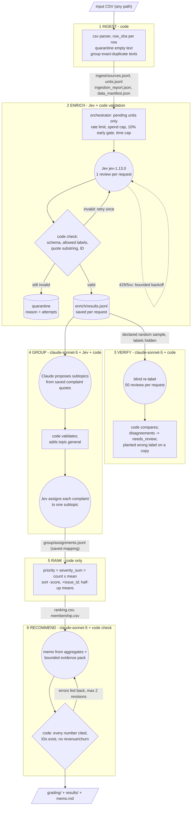

# Spotify review insight pipeline (Final Assignment)

Advising Spotify at the end of the May 2022 – Nov 2023 review window: **where should next quarter's product effort go — access, usability, playback, or billing/support?** This repository is a saved program that turns the 660,622-review CSV into that recommendation, with traceable evidence.

> **Status: pipeline built and tested offline only.** No development run or full-corpus run has been made yet, so this README reports no results, costs or labels. Every results section below is marked *pending* until real runs fill it. Offline tests use fake providers and are **not** run evidence.

- Grading export: [`grading/`](grading/) *(pending: full run)*
- Human-readable results: [`results/`](results/) *(pending: full run)*
- Decision memo: [`results/memo.md`](results/memo.md) *(pending)*
- Design choices and label examples: [`DESIGN.md`](DESIGN.md)
- Golden-set labelling instructions: [`evals/golden/LABELING.md`](evals/golden/LABELING.md)

## Rubric → evidence map

| Rubric item | Evidence |
|---|---|
| **Deliverable 1** Accessible code, setup and artifacts | [Setup](#setup), [Run](#run), `requirements.txt`, `.env.example` (key names only), [`results/`](results/) *(pending)* |
| **Deliverable 2** Architecture, shared schema, provenance | [Architecture](#architecture), `pipeline/rubric.py` (Jev questions), `pipeline/verify.py` / `group.py` / `memo.py` (role prompts and schemas), `label_config` on every record and call, `run_manifest.json` (code version, argv, settings) |
| **Deliverable 3** Memo numbers linked to calculations and evidence | `claims.csv` ↔ `ranking.csv` (course checker recomputes both), `memo_check.json` (every number cited, and every issue ID and review ID validated) *(pending)* |
| **Deliverable 4** Recommendation, alternatives, limitations | [`results/memo.md`](results/memo.md) *(pending)*, [Limits](#limits) |
| **Testing 1** 50 human labels, per-field comparison, error analysis | [`evals/golden/`](evals/golden/): your labels, `summary.json`, `cases.json`, `disagreements.md` *(pending: your labels, then a golden run)* |
| **Testing 2** Independent verification, planted-error and injection tests | `results/verification_report.json` and `verification_comparisons.json` *(pending)*; `results/planted_label_test.json` *(pending)*; [`evals/offline/planted_export_errors.json`](evals/offline/planted_export_errors.json); `runs/eval-injection/results.json` → `evals/injection_results.json` *(pending)* |
| **Testing 3** Validation, bounded retries, failure accounting, usage, recovery | `pipeline/retry.py`, `results/run_summary.json` (retries, failures, tokens, cost, time) *(pending)*, `results/quarantine.jsonl` *(pending)*, [`evals/offline/test_report.txt`](evals/offline/test_report.txt) |
| **Working 1** Full ingestion, coverage, classification | `results/ingestion_report.json`, `grading/ingestion.json`, self-check coverage *(pending)* |
| **Working 2** Staged program, bounded calls, handoffs, resume | `python -m pipeline run`, `grading/calls.jsonl.gz`, `checkpoint_before.json` / `checkpoint_after.json`, recording *(pending)* |
| **Working 3** Reproducible ranking, grounded output | `python -m pipeline rerank --grading-dir grading` (no model calls), `results/aggregates.csv`, memo *(pending)* |

## Architecture



In the diagram, circles are model judgments and rectangles and diamonds are code. Code owns dispatch, state, validation, budgets, retries, record accounting and every piece of arithmetic. The models only read language:

- **Jev** answers fixed-choice questions.
- **Claude** handles blind verification, naming subtopics, and writing the memo.

Every handoff is saved, and each stage has its own stop condition:

| Stage | Input | Output | On failure | Stops when |
|---|---|---|---|---|
| ingest | CSV | sources, units, profiles | duplicate ID → abort (contract needs one record per ID) | file read |
| enrich | pending units | results, failures, checkpoints | invalid → 1 retry → quarantine; transient → backoff ≤5 attempts | all units done, spend cap, early gate, time cap, Ctrl-C, `--stop-after-units` |
| verify | declared random sample (text only) | verdicts, report, planted test | invalid → 1 retry with the error; transient → backoff | sample done or cap |
| group | complaint quotes → taxonomy; complaint texts → Jev | issues.json, assignments.jsonl | failed assignment → `<topic>.general` with the reason recorded | all complaints assigned |
| rank | records + membership | ranking.csv, membership.csv | invalid severity or duplicate pair → abort | — |
| recommend | aggregates + evidence pack | memo.md, claims, check | check errors fed back, up to 2 revisions, then saved with the failing check | check passes or 3 rounds |

## Models, settings and roles

| Role (`calls.jsonl`) | Model ID | Settings | Prompt version |
|---|---|---|---|
| enrich | `jev-1.13.0` (pinned, not the alias) | 1 review per request; Choice for topic, intent and severity; Score for sentiment; Noul for "unclear"; Choice over code-cut sentences for the quote | `label_config` = `jev-1.13.0+prompt-<hash>+schema-v1` |
| verify | `claude-sonnet-5` | adaptive thinking, effort medium, JSON-schema output, 50 per request, `max_tokens` 16000 | `claude-sonnet-5+verify-<hash>+schema-v1` |
| group | `claude-sonnet-5` then `jev-1.13.0` | taxonomy via JSON schema; Jev Choice per complaint | `...+group-taxonomy-<hash>`, `...+group-assign-<hash>` |
| memo | `claude-sonnet-5` | plain markdown, code check, up to 3 rounds | `claude-sonnet-5+memo-<hash>+schema-v1` |

Each hash is taken over the exact prompt, schema and post-processing rules, so changing any of them creates new work rather than reusing cached results. Only `review_text` is sent to any model. The golden-50 human labels are read only by `score-golden`. Golden review IDs are also kept out of the verification sample, the taxonomy examples and the memo evidence pack (`--exclude-golden`).

## Setup

Python 3.11 is required.

```bash
git clone <this repo> && cd spotify-insight-pipeline
python3 -m venv .venv && .venv/bin/pip install --no-cache-dir -r requirements.txt   # anthropic==0.86.0; rest is stdlib
cp .env.example .env    # then paste TYPESAFE_API_KEY and ANTHROPIC_API_KEY (only needed for paid runs)
.venv/bin/python -m pipeline keys   # prints True/False per key, never the value
```

Data: download the course ZIP from the link in the assignment brief, unzip it anywhere, and point `DATA` at that folder. The raw CSV is not committed. Its SHA-256 is `1fc85de68a304dd8978b537cfa58793d5f41cbaf417fa32cb53899f83a2fcef6` (97,400,616 bytes).

## Run

**No API key is needed to inspect or re-rank.** These commands make no model calls:

```bash
.venv/bin/python -m pipeline rerank --grading-dir grading     # recompute ranking from records + membership; diff vs saved
.venv/bin/python -m pipeline check --input "$DATA/spotify_reviews_18months.csv" --grading-dir grading --out-dir runs/check
.venv/bin/python -m unittest discover -s tests -v             # offline tests (fake providers)
```

**Paid runs** (`DATA="$HOME/code/Final Assignment - Spotify Reviews Dataset"`; `G="--exclude-golden $DATA/golden_50_to_label.csv"`):

```bash
# 1) 500-review development run ($2 dev budget shared with step 2)
.venv/bin/python -m pipeline run --input "$DATA/checkpoint_500.csv" --run-dir runs/dev500 $G \
  --budget-group dev --budget-usd 2 --verify-n 100 --grading-dir runs/dev500/grading --results-dir runs/dev500/results
# 2) 10,000-review development checkpoint; also verifies all 268 non-English texts as a separate stratum
.venv/bin/python -m pipeline run --input "$DATA/analysis_10000.csv" --run-dir runs/dev10k $G \
  --budget-group dev --budget-usd 2 --verify-n 300 --verify-extra-groups non_english_latin,non_latin_script \
  --grading-dir runs/dev10k/grading --results-dir runs/dev10k/results
# 2b) Only if non-English agreement is clearly worse: translation test on those 268 texts
#     (enrichment only; reuses the 10k run's blind verifier labels; no second verification)
.venv/bin/python -m pipeline subset --input "$DATA/analysis_10000.csv" --out runs/lang10k/non_english.csv
.venv/bin/python -m pipeline run --input runs/lang10k/non_english.csv --run-dir runs/lang10k --translate \
  --stages ingest,enrich --budget-group dev --budget-usd 2
.venv/bin/python -m pipeline compare-translation --baseline-run runs/dev10k --translated-run runs/lang10k
# 3) Golden set: enrichment only, on a copy with the labels stripped; then score against your labels
.venv/bin/python -m pipeline golden-input --golden "$DATA/golden_50_to_label.csv" --out runs/golden/golden_50_texts.csv
.venv/bin/python -m pipeline run --input runs/golden/golden_50_texts.csv --run-dir runs/golden --stages ingest,enrich \
  --budget-group dev --budget-usd 2
.venv/bin/python -m pipeline score-golden --run-dir runs/golden --golden evals/golden/golden_50_human_labels.csv
# 4) Full run: interrupt after 5,000 enrichment requests (recorded), then resume to completion
.venv/bin/python -m pipeline run --input "$DATA/spotify_reviews_18months.csv" --run-dir runs/full $G \
  --budget-group full --budget-usd 40 --verify-n 1000 --stop-after-units 5000
.venv/bin/python -m pipeline run --input "$DATA/spotify_reviews_18months.csv" --run-dir runs/full $G \
  --budget-group full --budget-usd 40 --verify-n 1000 --grading-dir grading --results-dir results
# 5) Live prompt-injection cases (synthetic, excluded from business results)
.venv/bin/python -m pipeline eval-injection
```

**Resume:** rerun the same command. Completed units under the same `label_config` are never sent again. Calls made after the first invocation are logged as `phase: "resume"`.

**Interrupt:** press Ctrl-C once for a graceful stop. The program finishes in-flight requests, saves them, and writes a `completed_ids` snapshot. A second Ctrl-C aborts immediately.

## Spending, retries and failure accounting (all in code)

- **Hard cap per budget group.** The ledger in `budgets/<group>.jsonl` persists across runs. Before each call, a worst-case cost is reserved; for Claude that includes the full `max_tokens` of output. The call is not sent if it could exceed the cap.
- **Early 10% gate.** At 10% of enrichment units, the run's spend must be at most 10% of the cap. Otherwise the run halts and prints a projection. It continues only with `--accept-early-gate`.
- **Time cap.** `--max-minutes` stops dispatching and saves progress.
- **Retries.** Invalid output is retried **at most once**; for Claude, the validation error is fed back. After that, the unit is quarantined with the reason and attempt count. Rate limits and transient errors get bounded exponential backoff that honours `retry-after`: up to 5 attempts for Jev, 4 for Claude. Every failed attempt is logged as `outcome: "failed"`.
- **Exact-duplicate reuse.** 660,609 nonempty rows collapse to 484,189 distinct texts. The other IDs get `cache_source_id` pointing to the directly classified original. Every ID keeps its own record and is counted separately.
- **Statuses.** Each record is `completed`, or `quarantined` with a `reason` and `attempts`. Reasons are `empty_review_text`, `enrich_failed: …`, or `pending_not_processed` for an incomplete run.
- **Usage and cost.** These are provider-reported tokens times published list prices (Jev $0.042 per million input tokens, output free; Sonnet 5 $2/$10 per million), reported in `run_summary.json`. Failed attempts that returned no usage are logged with 0 tokens and `usage_available: false`; they are not estimated.

## Results *(pending — filled only from real runs)*

These are filled in from real runs; nothing here is estimated:
- 500 run, 10k run, and full run: rows, completed, quarantined, cache reuse, verifier disagreements, measured cost and time
- golden-set agreement
- one review traced from source ID through enrichment, verification, issue, rank, and memo claim
- one failed or ambiguous case and how it was handled

## Tests *(offline evidence in [`evals/offline/`](evals/offline/))*

Offline tests use fake providers, with no network and no spend. They cover:
- resume never re-sending completed IDs
- the spend cap, 10% gate and time cap
- the one-retry rule for invalid output, with quarantine and attempt counts
- transient-error backoff
- torn-file repair
- exact half-up ranking and tie order
- `rerank` identical from saved outputs
- verifier ID validation
- taxonomy validation
- memo checks for numbers, issue IDs and review IDs
- the planted wrong label caught by the verification comparison
- nine planted export errors, each flagged by the course checker

Run with `EVIDENCE_DIR=evals/offline` to refresh the saved outcomes. The live injection eval (`eval-injection`) has 12 synthetic cases: 7 adversarial and 5 controls.

## Limits

- **The data.** It is a historical, self-selected set of public Play Store reviews, with no revenue, plan tier, cost, or confirmed churn. Cancellation language is expressed intent, not observed churn.
- **Model agreement.** Agreement between Jev and Claude is not accuracy. The 50-review golden set is a small diagnostic, not a population estimate.
- **Language.** A deterministic tagger (`pipeline/language.py`) finds 18,821 distinct likely non-English texts in the full file, 3.9% of distinct texts. Verification agreement is reported per language group. Translation (`--translate`) is built but off. Whether to enable it is decided from the 10k comparison, and fixed before the full run, so every record shares one `label_config`.
- **Dates.** The first and last calendar months are partial.
